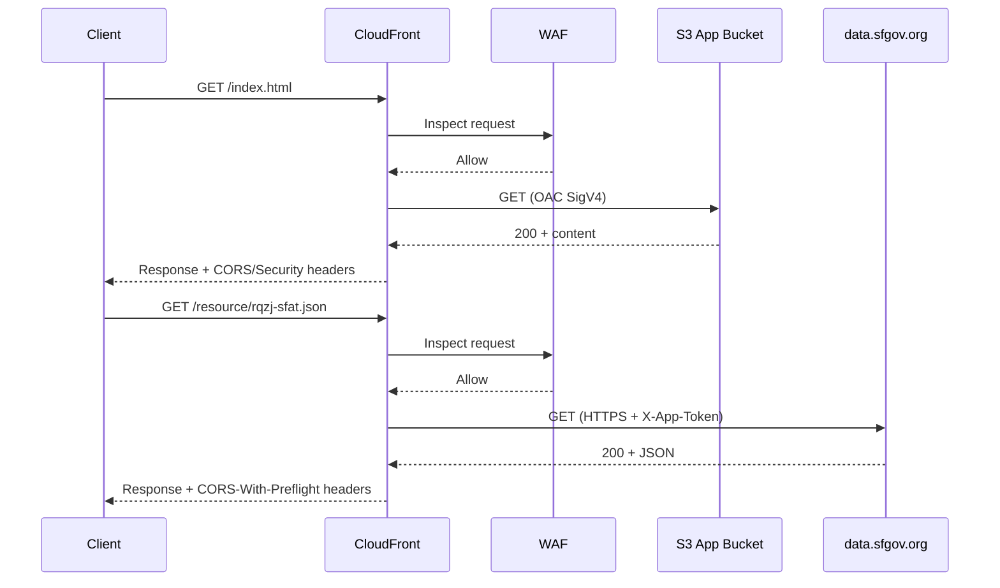

# Design Document: CloudFront Distribution

## Overview

This design defines the Terraform HCL configuration for an AWS CloudFront distribution in the GeoFoodTruck application. The distribution serves static React build assets from an S3 origin using Origin Access Control (OAC) with SigV4 signing, and proxies API requests to the SFGov Data API (`data.sfgov.org`) through a custom origin authenticated via an X-App-Token header sourced from AWS Systems Manager Parameter Store. The configuration includes managed and custom cache policies, a custom origin request policy, a custom response headers policy (CORS, security header enforcement, sensitive header removal), WAF Web ACL association, and access logging to an S3 log bucket. All Terraform HCL files reside in the `infra` directory at the project root.

### Design Decisions

1. **Shared `infra` directory** — CloudFront distribution resources are added to the existing `infra` directory alongside other infrastructure modules. This feature relies on the shared provider and data sources in `infra/main.tf` rather than declaring its own.
2. **OAC over OAI** — Origin Access Control (OAC) with SigV4 signing is used instead of the legacy Origin Access Identity (OAI), providing stronger authentication and compatibility with KMS-encrypted S3 buckets.
3. **SSM Parameter Store for secrets** — The SFGov API token is retrieved at plan/apply time via a `data.aws_ssm_parameter` data source with `with_decryption = true`, avoiding hardcoded secrets in version control.
4. **Managed + Custom policies** — AWS-managed cache and origin request policies are used where they align with requirements (CachingOptimized, CachingDisabled, CORS-S3Origin, CORS-With-Preflight). Custom policies are created only when the managed options lack needed behavior (SFGov origin request forwarding, response header removal).
5. **Dual origin architecture** — The distribution uses two origins: an S3 origin for static assets (default behavior) and a custom HTTPS origin for SFGov API proxying (ordered behavior on `/resource/rqzj-sfat.json`).

## Architecture

```mermaid
graph TD
    subgraph "infra/ Directory"
        A[cloudfront.tf] --> B[outputs.tf]
    end

    subgraph "CloudFront Resources"
        OAC[aws_cloudfront_origin_access_control]
        DIST[aws_cloudfront_distribution]
        CRP[aws_cloudfront_response_headers_policy - Custom]
        ORP[aws_cloudfront_origin_request_policy - Custom]
    end

    subgraph "Data Sources"
        SSM[data.aws_ssm_parameter]
        CP1[data.aws_cloudfront_cache_policy - CachingOptimized]
        CP2[data.aws_cloudfront_cache_policy - CachingDisabled]
        ORP_M[data.aws_cloudfront_origin_request_policy - CORS-S3Origin]
        RHP_M[data.aws_cloudfront_response_headers_policy - CORS-With-Preflight]
    end

    subgraph "External References"
        S3_APP[App Bucket - regional domain]
        S3_LOG[Log Bucket - regional domain]
        WAF[WAF Web ACL ARN]
    end

    OAC --> DIST
    SSM --> DIST
    CP1 --> DIST
    CP2 --> DIST
    ORP_M --> DIST
    ORP --> DIST
    CRP --> DIST
    RHP_M --> DIST
    S3_APP --> DIST
    S3_LOG --> DIST
    WAF --> DIST
```



### Request Flow



## Components and Interfaces

### File Structure

```
infra/
├── main.tf          # (existing) terraform block, provider, aws_caller_identity, aws_region
├── cloudfront.tf    # (NEW) SSM data source, managed policy data sources, OAC, custom policies, distribution
└── outputs.tf       # (existing, APPEND) Distribution domain name output
```

### cloudfront.tf Components

| Resource / Data Source | Terraform Identifier | Purpose |
|---|---|---|
| `terraform.required_providers` | — | Pins `hashicorp/aws` provider (in main.tf, not this feature) |
| `provider "aws"` | — | Configures `us-east-1` region (in main.tf, not this feature) |
| `data.aws_caller_identity` | `current` | Account ID reference (in main.tf, not this feature) |
| `data.aws_region` | `current` | Region reference (in main.tf, not this feature) |
| `data.aws_ssm_parameter` | `sfgov_geofoodtruck_aws_ssm_parameter` | SFGov API token retrieval (defined in ssm.tf by ssm-parameter-store-retrieval feature, not this feature) |
| `data.aws_cloudfront_cache_policy` | `geofoodtruck_cloudfront_cache_policy` | Managed-CachingOptimized reference |
| `data.aws_cloudfront_cache_policy` | `sfgov_geofoodtruck_cloudfront_cache_policy` | Managed-CachingDisabled reference |
| `data.aws_cloudfront_origin_request_policy` | `geofoodtruck_cloudfront_origin_request_policy` | Managed-CORS-S3Origin reference |
| `data.aws_cloudfront_response_headers_policy` | `sfgov_geofoodtruck_cloudfront_response_header_policy` | Managed-CORS-With-Preflight reference |
| `aws_cloudfront_origin_access_control` | `geofoodtruck_origin_access_control` | OAC for S3 origin SigV4 signing |
| `aws_cloudfront_response_headers_policy` | `geofoodtruck_cloudfront_response_header_policy` | Custom CORS + security + header removal |
| `aws_cloudfront_origin_request_policy` | `sfgov_geofoodtruck_cloudfront_origin_request_policy` | Custom origin request for SFGov |
| `aws_cloudfront_distribution` | `geofoodtruck_app_distribution` | Main distribution resource |
| `aws_s3_bucket_policy` | `geofoodtruck_app_bucket_policy` | App bucket policy granting CloudFront OAC read access |

### outputs.tf Components

| Output | Value | Purpose |
|---|---|---|
| `cloudfront_distribution_domain` | `aws_cloudfront_distribution.geofoodtruck_app_distribution.domain_name` | Exposes distribution endpoint for deployment scripts |

## Data Models

### Provider Configuration (`infra/main.tf` — already exists, not created by this feature)

The following are already declared in `infra/main.tf` and are NOT part of this feature's implementation:

- `terraform` block with `required_providers` (`hashicorp/aws`)
- `provider "aws"` with `region = "us-east-1"`
- `data "aws_caller_identity" "current" {}`
- `data "aws_region" "current" {}`

This feature relies on these existing declarations.

### SSM Parameter Data Source (`infra/ssm.tf` — already exists, not created by this feature)

The `data.aws_ssm_parameter.sfgov_geofoodtruck_aws_ssm_parameter` is defined in `infra/ssm.tf` by the ssm-parameter-store-retrieval feature. This feature references it via:

```hcl
value = data.aws_ssm_parameter.sfgov_geofoodtruck_aws_ssm_parameter.value
```

This feature does NOT define the SSM parameter data source.

### Managed Cache Policy Data Sources

```hcl
data "aws_cloudfront_cache_policy" "geofoodtruck_cloudfront_cache_policy" {
  name = "Managed-CachingOptimized"
}

data "aws_cloudfront_cache_policy" "sfgov_geofoodtruck_cloudfront_cache_policy" {
  name = "Managed-CachingDisabled"
}
```

### Managed Origin Request Policy Data Source

```hcl
data "aws_cloudfront_origin_request_policy" "geofoodtruck_cloudfront_origin_request_policy" {
  name = "Managed-CORS-S3Origin"
}
```

### Managed Response Headers Policy Data Source

```hcl
data "aws_cloudfront_response_headers_policy" "sfgov_geofoodtruck_cloudfront_response_header_policy" {
  name = "Managed-CORS-With-Preflight"
}
```

### Origin Access Control Resource

```hcl
resource "aws_cloudfront_origin_access_control" "geofoodtruck_origin_access_control" {
  name                              = "geofoodtruck-app-oac"
  origin_access_control_origin_type = "s3"
  signing_behavior                  = "always"
  signing_protocol                  = "sigv4"
  description                       = "Origin Access Control for GeoFoodTruck app"
}
```

### Custom Response Headers Policy

```hcl
resource "aws_cloudfront_response_headers_policy" "geofoodtruck_cloudfront_response_header_policy" {
  name    = "Custom-GeoFoodTruck-CORS-With-Preflight"
  comment = "Custom CORS with Preflight Response Policy for GeoFoodTruck"

  cors_config {
    access_control_allow_credentials = false

    access_control_allow_headers {
      items = ["*"]
    }

    access_control_allow_methods {
      items = ["GET", "HEAD", "PUT", "POST", "PATCH", "DELETE", "OPTIONS"]
    }

    access_control_allow_origins {
      items = ["*"]
    }

    access_control_expose_headers {
      items = ["*"]
    }

    origin_override = false
  }

  remove_headers_config {
    items {
      header = "Server"
    }

    items {
      header = "X-Amz-Server-Side-Encryption"
    }

    items {
      header = "X-Amz-Server-Side-Encryption-Aws-Kms-Key-Id"
    }
  }

  security_headers_config {
    strict_transport_security {
      access_control_max_age_sec = 31536000
      override                   = true
    }
  }
}
```

### Custom Origin Request Policy

```hcl
resource "aws_cloudfront_origin_request_policy" "sfgov_geofoodtruck_cloudfront_origin_request_policy" {
  name    = "Custom-DataSFGov-CORS-Origin"
  comment = "Custom CORS Origin Request Policy for SFGov Data API"

  cookies_config {
    cookie_behavior = "none"
  }

  headers_config {
    header_behavior = "whitelist"
    headers {
      items = ["origin"]
    }
  }

  query_strings_config {
    query_string_behavior = "all"
  }
}
```

### CloudFront Distribution Resource

```hcl
resource "aws_cloudfront_distribution" "geofoodtruck_app_distribution" {
  origin {
    domain_name              = aws_s3_bucket.geofoodtruck_app_bucket.bucket_regional_domain_name
    origin_id                = aws_s3_bucket.geofoodtruck_app_bucket.bucket_regional_domain_name
    origin_access_control_id = aws_cloudfront_origin_access_control.geofoodtruck_origin_access_control.id
  }

  origin {
    domain_name = "data.sfgov.org"
    origin_id   = "data.sfgov.org"

    custom_origin_config {
      http_port              = 80
      https_port             = 443
      origin_protocol_policy = "https-only"
      origin_ssl_protocols   = ["TLSv1.2"]
    }

    custom_header {
      name  = "X-App-Token"
      value = data.aws_ssm_parameter.sfgov_geofoodtruck_aws_ssm_parameter.value
    }
  }

  enabled             = true
  is_ipv6_enabled     = true
  default_root_object = "index.html"

  logging_config {
    include_cookies = false
    bucket          = aws_s3_bucket.geofoodtruck_log_bucket.bucket_regional_domain_name
  }

  default_cache_behavior {
    allowed_methods  = ["GET", "HEAD"]
    cached_methods   = ["GET", "HEAD"]
    compress         = true

    cache_policy_id            = data.aws_cloudfront_cache_policy.geofoodtruck_cloudfront_cache_policy.id
    origin_request_policy_id   = data.aws_cloudfront_origin_request_policy.geofoodtruck_cloudfront_origin_request_policy.id
    response_headers_policy_id = aws_cloudfront_response_headers_policy.geofoodtruck_cloudfront_response_header_policy.id

    target_origin_id       = aws_s3_bucket.geofoodtruck_app_bucket.bucket_regional_domain_name
    viewer_protocol_policy = "redirect-to-https"
  }

  ordered_cache_behavior {
    path_pattern     = "/resource/rqzj-sfat.json"
    allowed_methods  = ["GET", "HEAD", "OPTIONS"]
    cached_methods   = ["GET", "HEAD", "OPTIONS"]
    compress         = true

    cache_policy_id            = data.aws_cloudfront_cache_policy.sfgov_geofoodtruck_cloudfront_cache_policy.id
    origin_request_policy_id   = aws_cloudfront_origin_request_policy.sfgov_geofoodtruck_cloudfront_origin_request_policy.id
    response_headers_policy_id = data.aws_cloudfront_response_headers_policy.sfgov_geofoodtruck_cloudfront_response_header_policy.id

    target_origin_id       = "data.sfgov.org"
    viewer_protocol_policy = "https-only"
  }

  restrictions {
    geo_restriction {
      restriction_type = "none"
    }
  }

  viewer_certificate {
    cloudfront_default_certificate = true
  }

  web_acl_id = aws_wafv2_web_acl.geofoodtruck_waf_web_acl.arn
}
```

### Output Definition

```hcl
output "cloudfront_distribution_domain" {
  value = aws_cloudfront_distribution.geofoodtruck_app_distribution.domain_name
}
```

### App Bucket Policy for OAC Access

```hcl
resource "aws_s3_bucket_policy" "geofoodtruck_app_bucket_policy" {
  depends_on = [aws_cloudfront_distribution.geofoodtruck_app_distribution]
  bucket     = aws_s3_bucket.geofoodtruck_app_bucket.id

  policy = jsonencode({
    Version = "2012-10-17"
    Statement = [
      {
        Effect    = "Allow"
        Principal = { Service = "cloudfront.amazonaws.com" }
        Action    = ["s3:GetObject"]
        Resource  = ["${aws_s3_bucket.geofoodtruck_app_bucket.arn}/*"]
        Condition = {
          StringEquals = {
            "AWS:SourceArn" = aws_cloudfront_distribution.geofoodtruck_app_distribution.arn
          }
        }
      }
    ]
  })
}
```

## Correctness Properties

Since this is an Infrastructure as Code (Terraform) feature, property-based testing with randomized inputs is not applicable. Instead, correctness is expressed as **structural invariants** that can be verified via `terraform plan -out=plan.bin && terraform show -json plan.bin` JSON output, static analysis tools (Checkov, tflint), or `terraform validate`.

### Property 1: OAC Configuration Is Complete and Correct

The `aws_cloudfront_origin_access_control` resource SHALL have `name` equal to `"geofoodtruck-app-oac"`, `origin_access_control_origin_type` equal to `"s3"`, `signing_behavior` equal to `"always"`, and `signing_protocol` equal to `"sigv4"`.

**Validates: Requirements 1.1, 1.2, 1.3, 1.4, 1.5, 1.6**

### Property 2: SSM Parameter Is Referenced (Not Redeclared)

The `infra/cloudfront.tf` file SHALL NOT declare a `data "aws_ssm_parameter"` block. The distribution's custom header SHALL reference `data.aws_ssm_parameter.sfgov_geofoodtruck_aws_ssm_parameter.value` from `infra/ssm.tf`.

**Validates: Requirements 2.1, 2.2**

### Property 3: S3 Origin Uses OAC Authentication

The distribution's S3 origin block SHALL have `domain_name` and `origin_id` both set to the App Bucket's `bucket_regional_domain_name`, and `origin_access_control_id` referencing the OAC resource's `id` attribute.

**Validates: Requirements 3.1, 3.2, 3.3**

### Property 4: SFGov Origin Uses HTTPS with API Token Header

The distribution's custom origin block SHALL have `domain_name` and `origin_id` both set to `"data.sfgov.org"`, `origin_protocol_policy` set to `"https-only"`, `origin_ssl_protocols` containing `"TLSv1.2"`, and a `custom_header` with `name` equal to `"X-App-Token"` and `value` referencing the SSM parameter value.

**Validates: Requirements 4.1, 4.2, 4.3, 4.4**

### Property 5: Distribution General Settings Are Correct

The distribution resource SHALL have `enabled` equal to `true`, `is_ipv6_enabled` equal to `true`, and `default_root_object` equal to `"index.html"`.

**Validates: Requirements 5.1, 5.2, 5.3**

### Property 6: Logging Configuration References Log Bucket

The distribution's `logging_config` block SHALL have `bucket` set to the Log Bucket's `bucket_regional_domain_name` and `include_cookies` set to `false`.

**Validates: Requirements 6.1, 6.2, 6.3**

### Property 7: Default Cache Behavior Targets S3 Origin with Correct Policies

The `default_cache_behavior` block SHALL have `allowed_methods` and `cached_methods` both equal to `["GET", "HEAD"]`, `compress` equal to `true`, `viewer_protocol_policy` equal to `"redirect-to-https"`, `target_origin_id` referencing the App Bucket domain, and policy IDs referencing Managed-CachingOptimized, Managed-CORS-S3Origin, and the custom response headers policy respectively.

**Validates: Requirements 7.1, 7.2, 7.3, 7.4, 7.5, 7.6, 7.7, 7.8, 7.9**

### Property 8: Ordered Cache Behavior Targets SFGov with Correct Policies

The `ordered_cache_behavior` block SHALL have `path_pattern` equal to `"/resource/rqzj-sfat.json"`, `allowed_methods` and `cached_methods` both equal to `["GET", "HEAD", "OPTIONS"]`, `compress` equal to `true`, `viewer_protocol_policy` equal to `"https-only"`, `target_origin_id` equal to `"data.sfgov.org"`, and policy IDs referencing Managed-CachingDisabled, the custom origin request policy, and Managed-CORS-With-Preflight respectively.

**Validates: Requirements 8.1, 8.2, 8.3, 8.4, 8.5, 8.6, 8.7, 8.8, 8.9, 8.10**

### Property 9: Custom Origin Request Policy Forwards Origin Header and Query Strings

The `aws_cloudfront_origin_request_policy` resource SHALL have `name` equal to `"Custom-DataSFGov-CORS-Origin"`, `cookie_behavior` equal to `"none"`, `header_behavior` equal to `"whitelist"` with items `["origin"]`, and `query_string_behavior` equal to `"all"`.

**Validates: Requirements 9.1, 9.2, 9.3, 9.4, 9.5, 9.6**

### Property 10: Custom Response Headers Policy Enforces CORS, Security, and Header Removal

The `aws_cloudfront_response_headers_policy` resource SHALL have `name` equal to `"Custom-GeoFoodTruck-CORS-With-Preflight"`, CORS config with `access_control_allow_origins` items `["*"]`, `access_control_allow_methods` items including all seven HTTP methods, `origin_override` equal to `false`, `remove_headers_config` containing `Server`, `X-Amz-Server-Side-Encryption`, and `X-Amz-Server-Side-Encryption-Aws-Kms-Key-Id`, and `strict_transport_security.access_control_max_age_sec` equal to `31536000`.

**Validates: Requirements 10.1, 10.2, 10.3, 10.4, 10.5, 10.6, 10.7, 10.8, 10.9, 10.10, 10.11**

### Property 11: Managed Policy Data Sources Reference Correct Names

The plan SHALL contain exactly two `data.aws_cloudfront_cache_policy` data sources with names `"Managed-CachingOptimized"` and `"Managed-CachingDisabled"`, one `data.aws_cloudfront_origin_request_policy` with name `"Managed-CORS-S3Origin"`, and one `data.aws_cloudfront_response_headers_policy` with name `"Managed-CORS-With-Preflight"`.

**Validates: Requirements 11.1, 11.2, 12.1, 13.1**

### Property 12: Geo Restriction Is Unrestricted

The distribution's `restrictions.geo_restriction` block SHALL have `restriction_type` equal to `"none"`.

**Validates: Requirements 14.1, 14.2**

### Property 13: Viewer Certificate Uses CloudFront Default

The distribution's `viewer_certificate` block SHALL have `cloudfront_default_certificate` equal to `true`.

**Validates: Requirements 15.1, 15.2**

### Property 14: WAF Web ACL Is Associated

The distribution resource SHALL have `web_acl_id` set to the ARN of the WAF Web ACL resource.

**Validates: Requirements 16.1**

### Property 15: Output Exports Distribution Domain Name

The Terraform configuration SHALL define an output named `cloudfront_distribution_domain` with value referencing `aws_cloudfront_distribution.geofoodtruck_app_distribution.domain_name`.

**Validates: Requirements 17.1**

### Property 16: Module Structure and No Duplicate Declarations

The `infra/cloudfront.tf` file SHALL NOT declare `terraform` blocks, `provider` blocks, `data "aws_caller_identity"`, or `data "aws_region"` — these are managed in `infra/main.tf`. This feature adds `cloudfront.tf` and appends to `outputs.tf`.

**Validates: Requirements 18.1, 18.2, 18.3, 18.4**

### Property 17: Bucket Policy Restricts Access to CloudFront Only

The `aws_s3_bucket_policy` resource's `policy` attribute, when decoded from JSON, SHALL contain exactly one statement with Principal Service equal to `"cloudfront.amazonaws.com"` and a `Condition.StringEquals["AWS:SourceArn"]` referencing the CloudFront distribution ARN.

**Validates: Requirements 19.2, 19.3**

## Error Handling

| Scenario | Behavior | Mitigation |
|---|---|---|
| SSM parameter does not exist | `terraform plan` fails with `ParameterNotFound` | Document prerequisite: parameter must be created before first apply |
| SSM parameter not decryptable | `terraform plan` fails with `AccessDeniedException` | Ensure IAM role has `ssm:GetParameter` and `kms:Decrypt` permissions |
| Managed policy name typo | `terraform plan` fails with `CachePolicyNotFound` | Policy names match AWS documentation exactly |
| WAF Web ACL not yet created | Distribution apply fails with invalid `web_acl_id` | WAF resources must be applied before distribution module |
| S3 bucket not yet created | Distribution plan fails with unresolved reference | S3 module must be applied before CloudFront module |
| SFGov origin unreachable | Distribution deploys but health checks fail | CloudFront origin failover not configured; monitoring required |
| Invalid OAC signing protocol | Apply fails with `InvalidArgument` | Protocol fixed to `sigv4`; no user-configurable input |
| Duplicate policy names | Apply fails with `PolicyAlreadyExists` | Custom policy names use project-specific prefixes |

## Testing Strategy

Since this feature is Infrastructure as Code (Terraform HCL), property-based testing with randomized inputs does not apply. The testing strategy uses static validation, plan-based assertions, and integration verification.

### Static Validation

- **`terraform validate`** — Verifies HCL syntax, resource schema correctness, and provider compatibility.
- **`terraform fmt -check`** — Ensures consistent formatting across all files in `infra/`.
- **tflint** — Catches deprecated attributes, invalid argument values, and AWS provider-specific issues.

### Plan-Based Structural Tests

Write assertions against `terraform show -json` output from a plan file to verify:

1. OAC resource attributes (name, type, signing behavior, signing protocol)
2. SSM data source points to correct parameter path with decryption enabled
3. Distribution has exactly two origins (S3 and custom)
4. S3 origin has `origin_access_control_id` set
5. Custom origin has `custom_header` with `X-App-Token`
6. Default behavior uses CachingOptimized, CORS-S3Origin, custom response headers
7. Ordered behavior uses CachingDisabled, custom origin request, CORS-With-Preflight
8. Ordered behavior `path_pattern` equals `/resource/rqzj-sfat.json`
9. Custom response headers policy removes exactly three headers
10. HSTS max-age is 31536000
11. Geo restriction type is `none`
12. Viewer certificate uses CloudFront default
13. `web_acl_id` references WAF ACL ARN
14. Output `cloudfront_distribution_domain` is defined

These can be implemented as shell scripts parsing `jq` output or using a test framework (e.g., `conftest` with OPA/Rego policies, or `pytest` parsing the plan JSON).

### Security Scanning

- **Checkov** — Run against the `infra/` directory using the project's existing `checkov.yaml` configuration to verify no security violations (HTTPS enforcement, encryption in transit, WAF association).

### Integration Verification

- **`terraform plan`** — Verify no errors with real AWS credentials (dry-run).
- **`terraform apply` in a non-production environment** — Confirm distribution creates with correct configuration.
- **Post-apply validation** — Use AWS CLI (`aws cloudfront get-distribution-config`) to verify origins, behaviors, policies, and WAF association match expected values.

### Test Coverage by Requirement

| Requirement | Test Method |
|---|---|
| 1 (OAC Resource) | Plan JSON attribute check |
| 2 (SSM Parameter) | Plan JSON data source check |
| 3 (S3 Origin) | Plan JSON origin block check |
| 4 (SFGov Custom Origin) | Plan JSON origin + custom_header check |
| 5 (General Settings) | Plan JSON distribution attributes |
| 6 (Logging Config) | Plan JSON logging_config check |
| 7 (Default Cache Behavior) | Plan JSON behavior + policy ID check |
| 8 (Ordered Cache Behavior) | Plan JSON behavior + path_pattern check |
| 9 (Custom Origin Request Policy) | Plan JSON resource attributes |
| 10 (Custom Response Headers Policy) | Plan JSON CORS + remove_headers + HSTS check |
| 11 (Managed Cache Policies) | Plan JSON data source names |
| 12 (Managed Origin Request Policy) | Plan JSON data source name |
| 13 (Managed Response Headers Policy) | Plan JSON data source name |
| 14 (Geo Restriction) | Plan JSON restrictions block |
| 15 (Viewer Certificate) | Plan JSON viewer_certificate block |
| 16 (WAF Association) | Plan JSON web_acl_id check |
| 17 (Output) | Plan JSON output definitions |
| 18 (Module Structure) | File existence + terraform validate + provider check |
| 19 (App Bucket Policy) | Plan JSON policy document parse + depends_on check |
