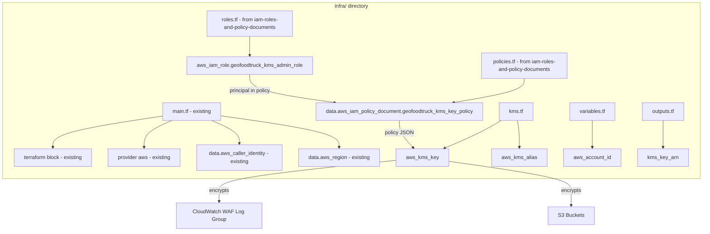

# Design Document: Customer-Managed KMS Key

## Overview

This design defines the Terraform HCL architecture for a customer-managed AWS KMS key that provides centralized encryption for the GeoFoodTruck application. The configuration resides in the `infra` directory at the project root.

The KMS key encrypts data at rest for:
- CloudWatch Logs (WAF log group)
- S3 buckets (app bucket and log bucket, managed by the s3-static-app-and-log-buckets feature)

The KMS key ARN is exposed as an output for consumption by other features. The key policy document and admin role are managed by the iam-roles-and-policy-documents feature in `infra/policies.tf` and `infra/roles.tf`.

## Architecture



### Design Decisions

1. **Shared `infra` directory**: KMS resources are added to the existing `infra` directory alongside other infrastructure modules. This feature relies on the shared provider and data sources in `infra/main.tf` rather than declaring its own.
2. **Key policy managed externally**: The `data "aws_iam_policy_document"` for the key policy is defined in `infra/policies.tf` by the iam-roles-and-policy-documents feature, keeping all policy documents centralized.
3. **Admin role managed externally**: The `aws_iam_role` for KMS administration is defined in `infra/roles.tf` by the iam-roles-and-policy-documents feature, keeping all roles centralized.
4. **Dynamic region and account references**: The key policy uses `data.aws_region.current.name` and `var.aws_account_id` for all dynamic values (managed in policies.tf).

## Components and Interfaces

### File Structure

```
infra/
├── main.tf          # (existing) terraform block, provider, aws_caller_identity, aws_region
├── kms.tf           # (NEW) KMS key resource and KMS alias only
├── policies.tf      # (from iam-roles-and-policy-documents) contains geofoodtruck_kms_key_policy
├── roles.tf         # (from iam-roles-and-policy-documents) contains geofoodtruck_kms_admin_role
├── variables.tf     # (existing, APPEND) aws_account_id variable with validation
└── outputs.tf       # (existing, APPEND) kms_key_arn output
```

### kms.tf Components

| Resource | Terraform Identifier | Purpose |
|---|---|---|
| `aws_kms_key` | `geofoodtruck_kms_key` | Customer-managed symmetric encryption key |
| `aws_kms_alias` | `geofoodtruck_kms_alias` | Human-readable alias for the key |

### External References (not defined by this feature)

| Resource | Identifier | Location | Feature |
|---|---|---|---|
| `data.aws_iam_policy_document` | `geofoodtruck_kms_key_policy` | `infra/policies.tf` | iam-roles-and-policy-documents |
| `aws_iam_role` | `geofoodtruck_kms_admin_role` | `infra/roles.tf` | iam-roles-and-policy-documents |
| `aws_iam_role_policy_attachment` | `geofoodtruck_kms_admin_policy_attachment` | `infra/policies.tf` | iam-roles-and-policy-documents |
| `aws_iam_role_policy_attachments_exclusive` | `geofoodtruck_kms_admin_policy_exclusive` | `infra/policies.tf` | iam-roles-and-policy-documents |

## Data Models

### KMS Key Resource

```hcl
resource "aws_kms_key" "geofoodtruck_kms_key" {
  description              = "KMS key for GeoFoodTruck"
  is_enabled               = true
  key_usage                = "ENCRYPT_DECRYPT"
  customer_master_key_spec = "SYMMETRIC_DEFAULT"
  enable_key_rotation      = true
  rotation_period_in_days  = 180
  deletion_window_in_days  = 30
  multi_region             = false
  policy                   = data.aws_iam_policy_document.geofoodtruck_kms_key_policy.json

  tags = {
    Name = "geofoodtruck-kms-key"
  }
}
```

### KMS Alias Resource

```hcl
resource "aws_kms_alias" "geofoodtruck_kms_alias" {
  name          = "alias/geofoodtruck-kms-key"
  target_key_id = aws_kms_key.geofoodtruck_kms_key.key_id
}
```

### Key Policy Document (`infra/policies.tf` — not created by this feature)

The key policy document `data.aws_iam_policy_document.geofoodtruck_kms_key_policy` is defined in `infra/policies.tf` by the iam-roles-and-policy-documents feature. This feature references it via:

```hcl
policy = data.aws_iam_policy_document.geofoodtruck_kms_key_policy.json
```

### variables.tf

```hcl
variable "aws_account_id" {
  description = "AWS account ID for resource policy references"
  type        = string
  sensitive   = true

  validation {
    condition     = can(regex("^[0-9]{12}$", var.aws_account_id))
    error_message = "aws_account_id must be exactly 12 digits."
  }
}
```

### outputs.tf

```hcl
output "kms_key_arn" {
  description = "ARN of the customer-managed KMS key"
  value       = aws_kms_key.geofoodtruck_kms_key.arn
}
```

## Correctness Properties

Since this is Infrastructure as Code (Terraform HCL), traditional property-based testing with randomized inputs does not apply. Instead, correctness is expressed as **structural invariants** verifiable through `terraform plan` output or static analysis.

### Property 1: KMS Key Spec Integrity

The planned `aws_kms_key.geofoodtruck_kms_key` resource SHALL have `customer_master_key_spec = "SYMMETRIC_DEFAULT"`, `key_usage = "ENCRYPT_DECRYPT"`, `is_enabled = true`, and `multi_region = false`.

**Validates: Requirements 1.1, 1.2, 1.3, 1.6**

### Property 2: Key Rotation Configuration

The planned `aws_kms_key.geofoodtruck_kms_key` resource SHALL have `enable_key_rotation = true` and `rotation_period_in_days = 180`.

**Validates: Requirements 2.1, 2.2**

### Property 3: Key Policy References External Policy Document

The `aws_kms_key.geofoodtruck_kms_key` resource SHALL set its `policy` attribute to `data.aws_iam_policy_document.geofoodtruck_kms_key_policy.json` — referencing the policy document from `infra/policies.tf`.

**Validates: Requirements 3.1**

### Property 4: No IAM Role or Policy Document Defined in kms.tf

The `infra/kms.tf` file SHALL NOT declare any `aws_iam_role`, `aws_iam_role_policy_attachment`, `aws_iam_role_policy_attachments_exclusive`, or `data "aws_iam_policy_document"` resources — these are managed in `infra/roles.tf` and `infra/policies.tf`.

**Validates: Requirements 3.2, 3.3**

### Property 5: Variable Validation Rejects Invalid Account IDs

Running `terraform plan` with `aws_account_id` set to a non-12-digit value SHALL fail with a validation error.

**Validates: Requirements 10.3**

### Property 6: Output Exposes Full KMS ARN

The `terraform plan` output SHALL include an output named `kms_key_arn` whose value is the full ARN of the KMS key resource.

**Validates: Requirements 3.4, 10.4**

### Property 7: KMS Alias Targets Correct Key

The `aws_kms_alias.geofoodtruck_kms_alias` resource SHALL have `name = "alias/geofoodtruck-kms-key"` and `target_key_id` referencing `aws_kms_key.geofoodtruck_kms_key.key_id`.

**Validates: Requirements 8.2**

## Error Handling

| Scenario | Behavior |
|----------|----------|
| Invalid `aws_account_id` (not 12 digits) | Terraform fails at plan time with variable validation error |
| KMS key deletion during `terraform destroy` | 30-day deletion window prevents immediate key loss; key remains recoverable |
| Missing AWS credentials | Terraform provider fails to initialize; no partial state changes |
| Key policy document not yet defined in policies.tf | `terraform validate` fails with unresolved reference to `data.aws_iam_policy_document.geofoodtruck_kms_key_policy` |

## Testing Strategy

Since this feature is Infrastructure as Code (Terraform), property-based testing with randomized inputs is not applicable. The testing strategy uses:

### Static Analysis
- **`terraform validate`**: Confirms HCL syntax and internal reference consistency.
- **`terraform fmt -check`**: Enforces canonical formatting.
- **Checkov / tfsec**: Policy-as-code scanners to verify encryption enabled and rotation configured.

### Plan-Based Assertions
- Run `terraform plan -out=plan.bin` with a valid `aws_account_id` variable.
- Convert to JSON: `terraform show -json plan.bin`.
- Assert structural properties (Properties 1–7) against the JSON plan output.

### Integration Tests
- Apply to a test account and verify:
  - KMS key exists, is enabled, has correct alias.
  - CloudWatch Log Group accepts the KMS key ARN without errors.

### Validation Tests
- Provide invalid `aws_account_id` values and confirm `terraform plan` fails.
- Confirm `terraform plan` succeeds with a valid 12-digit account ID.
