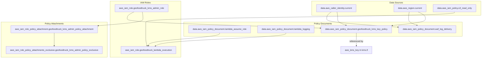

# Design Document

## Overview

This design defines the Terraform HCL architecture for IAM roles and policy documents supporting the GeoFoodTruck infrastructure. The configuration lives in the existing `infra` directory at the project root, organized into dedicated files by resource type. The design uses composable `data "aws_iam_policy_document"` blocks for Terraform-native validation.

The infrastructure supports three primary IAM concerns:
1. Lambda@Edge execution permissions for the XSS protection function
2. WAF log delivery authorization for CloudWatch Logs
3. KMS key policy and administration role for the customer-managed encryption key

All policies follow least-privilege principles with explicitly enumerated actions and resource-scoped ARNs.

## Architecture

### Directory Layout

```
infra/
├── main.tf          # (existing) AWS provider, terraform block, aws_caller_identity, aws_region
├── roles.tf         # (NEW) IAM role resources (Lambda execution, KMS admin)
├── policies.tf      # (NEW) Policy document data sources, managed policy lookups, policy attachments
└── variables.tf     # (existing, APPEND) Input variables with validation
```

### Resource Dependency Graph



## Components and Interfaces

### main.tf (already exists, not created by this feature)

The following are already declared in `infra/main.tf` and are NOT part of this feature's implementation:

- `terraform` block with `required_providers` (`hashicorp/aws`, `~> 5.0`)
- `provider "aws"` with `region = "us-east-1"`
- `data "aws_caller_identity" "current" {}`
- `data "aws_region" "current" {}`

This feature relies on these existing declarations.

### roles.tf

Defines IAM role resources with their assume role policies and inline policies.

#### Lambda Execution Role

```hcl
resource "aws_iam_role" "geofoodtruck_lambda_execution" {
  name               = "GeoFoodTruckLambdaExecution"
  assume_role_policy = data.aws_iam_policy_document.geofoodtruck_lambda_assume_role.json

  inline_policy {
    name   = "GeoFoodTruckLambdaBasicExecution"
    policy = data.aws_iam_policy_document.geofoodtruck_lambda_logging.json
  }

  managed_policy_arns = [data.aws_iam_policy.geofoodtruck_s3_read_only.arn]

  tags = {
    Name = "geofoodtruck-lambda-execution"
  }
}
```

#### KMS Admin Role

```hcl
resource "aws_iam_role" "geofoodtruck_kms_admin_role" {
  name               = "GeoFoodTruckKmsAdmin"
  assume_role_policy = jsonencode({
    Version = "2012-10-17"
    Statement = [
      {
        Effect    = "Allow"
        Action    = "sts:AssumeRole"
        Principal = {
          AWS = "arn:aws:iam::${var.aws_account_id}:root"
        }
      }
    ]
  })

  tags = {
    Name = "geofoodtruck-kms-admin"
  }
}
```

### policies.tf

Contains all `data "aws_iam_policy_document"` blocks, managed policy lookups, and policy attachment resources.

#### Managed Policy Lookups

```hcl
data "aws_iam_policy" "geofoodtruck_s3_read_only" {
  arn = "arn:aws:iam::aws:policy/AmazonS3ReadOnlyAccess"
}
```

#### Lambda Assume Role Policy

```hcl
data "aws_iam_policy_document" "geofoodtruck_lambda_assume_role" {
  statement {
    effect  = "Allow"
    actions = ["sts:AssumeRole"]

    principals {
      type        = "Service"
      identifiers = [
        "lambda.amazonaws.com",
        "edgelambda.amazonaws.com"
      ]
    }
  }
}
```

#### Lambda Logging Policy

```hcl
data "aws_iam_policy_document" "geofoodtruck_lambda_logging" {
  statement {
    effect = "Allow"
    actions = [
      "logs:CreateLogGroup",
      "logs:CreateLogStream",
      "logs:PutLogEvents"
    ]
    # Lambda@Edge executes in multiple regions with dynamic log stream names.
    # The specific log group ARN cannot be predetermined because CloudFront
    # replicates the function to edge locations in various regions.
    resources = ["arn:aws:logs:*:*:*"]
  }
}
```

#### WAF Log Delivery Policy

```hcl
data "aws_iam_policy_document" "geofoodtruck_waf_log_delivery" {
  version = "2012-10-17"

  statement {
    effect = "Allow"

    principals {
      type        = "Service"
      identifiers = ["delivery.logs.amazonaws.com"]
    }

    actions = [
      "logs:CreateLogStream",
      "logs:PutLogEvents"
    ]

    resources = [
      "arn:aws:logs:${data.aws_region.current.name}:${data.aws_caller_identity.current.account_id}:log-group:aws-waf-logs-geofoodtruck-log-group:*"
    ]

    condition {
      test     = "ArnLike"
      variable = "aws:SourceArn"
      values   = ["arn:aws:logs:${data.aws_region.current.name}:${data.aws_caller_identity.current.account_id}:*"]
    }

    condition {
      test     = "StringEquals"
      variable = "aws:SourceAccount"
      values   = [data.aws_caller_identity.current.account_id]
    }
  }
}
```

#### KMS Key Policy Document

```hcl
data "aws_iam_policy_document" "geofoodtruck_kms_key_policy" {
  statement {
    sid       = "EnableIAMUserPermissions"
    effect    = "Allow"
    actions   = ["kms:*"]
    resources = ["*"]

    principals {
      type = "AWS"
      identifiers = [
        aws_iam_role.geofoodtruck_kms_admin_role.arn,
        "arn:aws:iam::${var.aws_account_id}:root"
      ]
    }
  }

  statement {
    sid    = "AllowCloudFrontServiceAccess"
    effect = "Allow"
    actions = [
      "kms:Encrypt",
      "kms:Decrypt",
      "kms:GenerateDataKey*"
    ]
    resources = ["*"]

    principals {
      type        = "Service"
      identifiers = ["cloudfront.amazonaws.com"]
    }
  }

  statement {
    sid    = "AllowLogDeliveryServiceAccess"
    effect = "Allow"
    actions = [
      "kms:GenerateDataKey*",
      "kms:Decrypt"
    ]
    resources = ["*"]

    principals {
      type        = "Service"
      identifiers = ["delivery.logs.amazonaws.com"]
    }

    condition {
      test     = "StringEquals"
      variable = "aws:SourceAccount"
      values   = [var.aws_account_id]
    }
  }

  statement {
    sid    = "AllowCloudWatchLogsServiceAccess"
    effect = "Allow"
    actions = [
      "kms:Encrypt*",
      "kms:Decrypt*",
      "kms:ReEncrypt*",
      "kms:GenerateDataKey*",
      "kms:Describe*"
    ]
    resources = ["*"]

    principals {
      type        = "Service"
      identifiers = ["logs.${data.aws_region.current.name}.amazonaws.com"]
    }

    condition {
      test     = "ArnLike"
      variable = "kms:EncryptionContext:aws:logs:arn"
      values   = ["arn:aws:logs:${data.aws_region.current.name}:${var.aws_account_id}:log-group:aws-waf-logs-geofoodtruck-log-group"]
    }
  }
}
```

#### KMS Admin Policy Attachment

```hcl
resource "aws_iam_role_policy_attachment" "geofoodtruck_kms_admin_policy_attachment" {
  role       = aws_iam_role.geofoodtruck_kms_admin_role.name
  policy_arn = "arn:aws:iam::aws:policy/AWSKeyManagementServicePowerUser"
}

resource "aws_iam_role_policy_attachments_exclusive" "geofoodtruck_kms_admin_policy_exclusive" {
  role_name   = aws_iam_role.geofoodtruck_kms_admin_role.name
  policy_arns = [aws_iam_role_policy_attachment.geofoodtruck_kms_admin_policy_attachment.policy_arn]
}
```

### variables.tf

```hcl
variable "aws_account_id" {
  description = "AWS account ID for IAM principal ARN construction"
  type        = string
  sensitive   = true

  validation {
    condition     = can(regex("^[0-9]{12}$", var.aws_account_id))
    error_message = "aws_account_id must be a 12-digit numeric string."
  }
}
```

## Data Models

### Resource Identifier Conventions

| Resource Type | Terraform Identifier Pattern | AWS Name Pattern | Tag Name Pattern |
|---|---|---|---|
| IAM Role | `geofoodtruck_<purpose>` | `GeoFoodTruck<Purpose>` | `geofoodtruck-<purpose>` |
| Policy Document | `geofoodtruck_<scope>_<function>` | N/A (data source) | N/A |
| Managed Policy Lookup | `geofoodtruck_<short_name>` | N/A (data source) | N/A |
| Policy Attachment | `geofoodtruck_<role>_policy_attachment` | N/A | N/A |

### IAM Role ↔ Policy Relationships

| Role | Assume Role Policy (Trust) | Inline Policies | Managed Policies | Attachment Method |
|---|---|---|---|---|
| `geofoodtruck_lambda_execution` | Lambda + Edge Lambda services | CloudWatch Logs write | AmazonS3ReadOnlyAccess | `managed_policy_arns` |
| `geofoodtruck_kms_admin_role` | Account root (`arn:aws:iam::{id}:root`) | — | AWSKeyManagementServicePowerUser | `aws_iam_role_policy_attachment` + `exclusive` |

### Variable Specifications

| Variable | Type | Sensitive | Validation | Purpose |
|---|---|---|---|---|
| `aws_account_id` | `string` | Yes | `^[0-9]{12}$` | Constructs IAM principal ARNs for trust policies and KMS key policy |

## Correctness Properties

### Property 1: Every IAM role has a policy-document-based assume role policy

*For any* IAM role resource defined in the module, the `assume_role_policy` attribute SHALL reference the `.json` output of a `data "aws_iam_policy_document"` data source or a `jsonencode()` block — never a raw heredoc string.

**Validates: Requirements 1.2, 4.4, 9.4**

### Property 2: Every IAM role carries a Name tag following the naming convention

*For any* IAM role resource defined in the module, the `tags` block SHALL include a `Name` key whose value matches the pattern `geofoodtruck-<purpose>`.

**Validates: Requirements 3.8, 9.5**

### Property 3: WAF log delivery policy includes both ArnLike and StringEquals conditions

The WAF log delivery policy document statement SHALL include exactly two conditions: one with test `ArnLike` on variable `aws:SourceArn`, and one with test `StringEquals` on variable `aws:SourceAccount`.

**Validates: Requirements 2.4, 2.5**

### Property 4: Lambda execution role trusts exactly the required service principals

The Lambda execution role's assume role policy SHALL grant `sts:AssumeRole` to exactly two service principals: `lambda.amazonaws.com` and `edgelambda.amazonaws.com`.

**Validates: Requirements 1.2**

### Property 5: KMS key policy contains exactly four statements

The `geofoodtruck_kms_key_policy` policy document SHALL produce exactly 4 statements with Sids: `EnableIAMUserPermissions`, `AllowCloudFrontServiceAccess`, `AllowLogDeliveryServiceAccess`, `AllowCloudWatchLogsServiceAccess`.

**Validates: Requirements 5.1, 6.1, 7.1, 8.1**

### Property 6: KMS admin role trusts only the account root

The `geofoodtruck_kms_admin_role` assume role policy SHALL grant `sts:AssumeRole` only to `arn:aws:iam::{account_id}:root`.

**Validates: Requirements 9.4**

### Property 7: KMS admin policy attached via dedicated resource with exclusivity

The `aws_iam_role_policy_attachment` SHALL attach exactly `AWSKeyManagementServicePowerUser`, and the `aws_iam_role_policy_attachments_exclusive` SHALL enforce no other policies.

**Validates: Requirements 9.2, 9.3**

### Property 8: No hardcoded region or account ID in KMS key policy

The rendered KMS key policy JSON SHALL NOT contain literal region strings or 12-digit account IDs. All such values SHALL use `data.aws_region.current.name` and `var.aws_account_id`.

**Validates: Requirements 8.3**

### Property 9: KMS key policy document is available for cross-feature reference

The `data.aws_iam_policy_document.geofoodtruck_kms_key_policy.json` expression SHALL be valid and resolvable by the customer-managed-kms feature.

**Validates: Requirements 10.1**

## Error Handling

| Failure Mode | Cause | Mitigation |
|---|---|---|
| Invalid assume role policy | Malformed principal ARN | Variable validation ensures 12-digit account ID format |
| Missing data source | `aws_caller_identity` or `aws_region` unavailable | These are always available in authenticated AWS sessions |
| Policy document too large | Exceeding 10,240 byte IAM policy limit | Individual policies are small and well-scoped |
| KMS admin role already exists | Name collision | Terraform import or state resolution |
| Policy attachment drift | External policy added to role | `aws_iam_role_policy_attachments_exclusive` detects and removes drift |

## Testing Strategy

### Static Analysis
- `terraform validate` — Catches HCL syntax errors and invalid resource references
- `terraform fmt -check` — Enforces consistent formatting
- `checkov` or `tfsec` — Scans for security misconfigurations

### Plan-Based Assertions
- `terraform plan -out=tfplan.bin` → `terraform show -json tfplan.bin`
- Validate all expected resources appear in the plan
- Verify policy documents contain expected actions, principals, and conditions
- Verify variable validation rejects invalid account IDs

### Integration Tests
- Apply to a test account and verify:
  - Lambda function can assume the execution role
  - KMS admin role can be assumed from within the account
  - WAF logs appear in CloudWatch after WAF rule triggers
  - KMS key policy references resolve correctly
