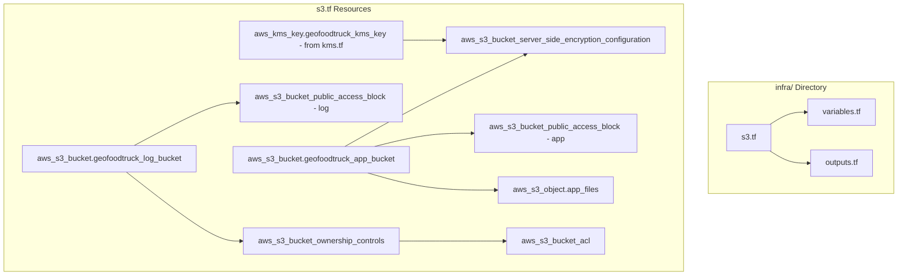
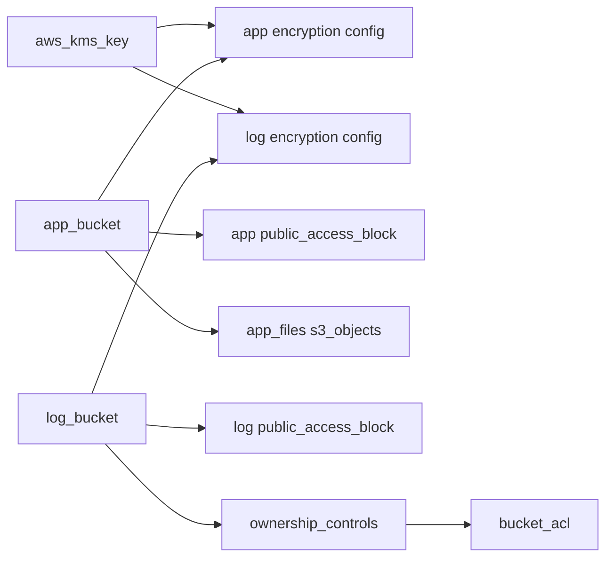

# Design Document: S3 Static App and Log Buckets

## Overview

This design defines the Terraform HCL configuration for two S3 buckets in the GeoFoodTruck application: an application bucket for hosting static React build assets served via CloudFront, and a log bucket for CloudFront access log storage. The configuration resides in an `infra` directory at the project root, organized into `main.tf`, `s3.tf`, `variables.tf`, and `outputs.tf`. Both buckets enforce KMS server-side encryption, block all public access, and follow the project's `geofoodtruck-` naming convention for AWS resources and `geofoodtruck_` prefix for Terraform resource identifiers.

### Design Decisions

1. **Shared `infra` directory** — S3 bucket resources are added to the existing `infra` directory alongside other infrastructure modules. This feature relies on the shared provider and data sources in `infra/main.tf` rather than declaring its own.
2. **Shared KMS key** — Both buckets reference a single `aws_kms_key` resource defined within the module, matching the existing pattern where CloudFront and log services share encryption through a centrally managed key.
3. **`for_each` with `fileset`** — Static file uploads use a deterministic `for_each` over `fileset()` output, enabling Terraform to detect individual file changes via `filemd5` etags without recreating the entire set.
4. **`depends_on` for ordering** — Explicit dependency on the CloudFront distribution for S3 object uploads prevents dangling ARN references and ensures the distribution exists before assets are uploaded.

## Architecture



### Resource Dependency Graph



## Components and Interfaces

### File Structure

```
infra/
├── main.tf          # (existing) terraform block, provider, aws_caller_identity, aws_region
├── s3.tf            # (NEW) KMS key, S3 buckets, encryption, public access blocks,
│                    # ownership controls, ACL, bucket policy, S3 object uploads
├── variables.tf     # (existing, APPEND) app_build_dir variable and locals
└── outputs.tf       # (existing, APPEND) Module outputs for cross-module references
```

### s3.tf Components

| Resource / Data Source | Terraform Identifier | Purpose |
|---|---|---|
| `data.aws_caller_identity` | `current` | Account ID reference (declared in main.tf, not this feature) |
| `data.aws_region` | `current` | Region reference (declared in main.tf, not this feature) |
| `aws_kms_key` | `geofoodtruck_kms_key` | Shared symmetric encryption key (defined in kms.tf by customer-managed-kms feature, not this feature) |
| `aws_s3_bucket` | `geofoodtruck_app_bucket` | Application asset bucket |
| `aws_s3_bucket_server_side_encryption_configuration` | `geofoodtruck_s3_bucket_server_side_encryption_configuration` | App bucket KMS encryption |
| `aws_s3_bucket_public_access_block` | `geofoodtruck_s3_bucket_public_access_block` | App bucket public access prevention |
| `aws_s3_bucket` | `geofoodtruck_log_bucket` | CloudFront log bucket |
| `aws_s3_bucket_server_side_encryption_configuration` | `geofoodtruck_s3_bucket_log_server_side_encryption_configuration` | Log bucket KMS encryption |
| `aws_s3_bucket_public_access_block` | `geofoodtruck_s3_bucket_log_public_access_block` | Log bucket public access prevention |
| `aws_s3_bucket_ownership_controls` | `geofoodtruck_s3_bucket_log_ownership_controls` | BucketOwnerPreferred for log delivery |
| `aws_s3_bucket_acl` | `geofoodtruck_log_bucket_acl` | Private ACL on log bucket |
| `aws_s3_object` | `app_files` | Static file uploads via `for_each` |

### variables.tf Components

| Item | Type | Purpose |
|---|---|---|
| `var.app_build_dir` | `string` (default: `"../build"`) | Path to compiled React assets |
| `local.app_build_files` | set of strings | Result of `fileset(var.app_build_dir, "**/**")` |
| `local.content_types` | map of strings | File extension to MIME type mapping |

### outputs.tf Components

| Output | Value | Purpose |
|---|---|---|
| `app_bucket_name` | `aws_s3_bucket.geofoodtruck_app_bucket.bucket` | Cross-module bucket name reference |
| `app_bucket_arn` | `aws_s3_bucket.geofoodtruck_app_bucket.arn` | IAM policy references |
| `app_bucket_regional_domain_name` | `aws_s3_bucket.geofoodtruck_app_bucket.bucket_regional_domain_name` | CloudFront origin config |
| `log_bucket_name` | `aws_s3_bucket.geofoodtruck_log_bucket.bucket` | Cross-module bucket name reference |
| `log_bucket_arn` | `aws_s3_bucket.geofoodtruck_log_bucket.arn` | IAM policy references |
| `log_bucket_regional_domain_name` | `aws_s3_bucket.geofoodtruck_log_bucket.bucket_regional_domain_name` | CloudFront logging config |

## Data Models

### Provider Configuration (`infra/main.tf` — already exists, not created by this feature)

The following are already declared in `infra/main.tf` and are NOT part of this feature's implementation:

- `terraform` block with `required_providers` (`hashicorp/aws`, `~> 5.0`)
- `provider "aws"` with `region = "us-east-1"`
- `data "aws_caller_identity" "current" {}`
- `data "aws_region" "current" {}`

This feature relies on these existing declarations.

### KMS Key Reference (`infra/kms.tf` — already exists, not created by this feature)

The `aws_kms_key.geofoodtruck_kms_key` resource is defined in `infra/kms.tf` by the customer-managed-kms feature. This feature references it via:

```hcl
kms_master_key_id = aws_kms_key.geofoodtruck_kms_key.arn
```

This feature does NOT define the KMS key, its policy, rotation settings, or tags.

### Content Type Map (locals)

```hcl
content_types = {
  "html" = "text/html"
  "css"  = "text/css"
  "js"   = "application/javascript"
  "png"  = "image/png"
  "ico"  = "image/x-icon"
  "txt"  = "text/plain"
  "json" = "application/json"
  "map"  = "application/json"
}
```

### S3 Object Upload Pattern

```hcl
resource "aws_s3_object" "app_files" {
  for_each     = { for file in local.app_build_files : file => file }
  bucket       = aws_s3_bucket.geofoodtruck_app_bucket.id
  key          = each.value
  source       = "${var.app_build_dir}/${each.value}"
  content_type = lookup(
    local.content_types,
    element(split(".", each.value), length(split(".", each.value)) - 1),
    "application/octet-stream"
  )
  etag = filemd5("${var.app_build_dir}/${each.value}")
}
```

## Correctness Properties

Since this is an Infrastructure as Code (Terraform) feature, property-based testing with randomized inputs is not applicable. Instead, correctness is expressed as **structural invariants** that can be verified via `terraform plan -out=plan.bin && terraform show -json plan.bin` JSON output, static analysis tools (Checkov, tflint), or `terraform validate`.

### Property 1: Both Buckets Enforce KMS Encryption

Every `aws_s3_bucket_server_side_encryption_configuration` resource in the plan output SHALL have `sse_algorithm` set to `"aws:kms"` and a non-empty `kms_master_key_id` referencing the module's KMS key ARN.

**Validates: Requirements 2.2, 2.3, 6.2, 6.3**

### Property 2: All Public Access Block Settings Are True

For every `aws_s3_bucket_public_access_block` resource in the plan output, all four attributes (`block_public_acls`, `block_public_policy`, `ignore_public_acls`, `restrict_public_buckets`) SHALL be `true`.

**Validates: Requirements 3.2, 3.3, 3.4, 3.5, 7.2, 7.3, 7.4, 7.5**

### Property 4: Log Bucket Ownership Controls Use BucketOwnerPreferred

The `aws_s3_bucket_ownership_controls` resource for the log bucket SHALL have `rule.object_ownership` set to `"BucketOwnerPreferred"`.

**Validates: Requirements 8.1, 8.2**

### Property 5: S3 Objects Have Content-Type Derived from Extension

For every `aws_s3_object` resource in the plan, the `content_type` attribute SHALL match the expected MIME type from the content_types map based on the file extension of the `key`, or default to `"application/octet-stream"` for unrecognized extensions.

**Validates: Requirements 10.6**

### Property 6: All Required Outputs Are Defined

The Terraform configuration SHALL define exactly six outputs: `app_bucket_name`, `app_bucket_arn`, `app_bucket_regional_domain_name`, `log_bucket_name`, `log_bucket_arn`, `log_bucket_regional_domain_name`.

**Validates: Requirements 12.1, 12.2, 12.3, 12.4, 12.5, 12.6**

### Property 7: Resource Naming Convention Compliance

Every S3 bucket resource SHALL have its `bucket` argument prefixed with `"geofoodtruck-"`, and every Terraform resource identifier for S3-related resources SHALL use the `geofoodtruck_` prefix.

**Validates: Requirements 1.1, 5.1**

### Property 8: Dependency Ordering Is Correct

The `aws_s3_bucket_acl` resource SHALL declare `depends_on` referencing the ownership controls resource.

**Validates: Requirements 9.3**

## Error Handling

| Scenario | Behavior | Mitigation |
|---|---|---|
| Build directory does not exist | `fileset()` returns empty set; no S3 objects created | Terraform plan shows zero `aws_s3_object` resources — validate before apply |
| KMS key deleted or disabled | Encryption config apply fails with `KMS.NotFoundException` | Key has `is_enabled = true` and rotation enabled; deletion protection via IAM policy |
| CloudFront distribution not yet created | `depends_on` prevents bucket policy and object upload from being planned without distribution | Explicit dependency graph ensures correct ordering |
| Unrecognized file extension | `lookup` defaults to `"application/octet-stream"` | Content-type map covers all standard React build artifacts |
| Bucket already exists (name conflict) | Terraform apply fails with `BucketAlreadyExists` | Bucket names include project prefix to reduce collision risk |
| ACL applied before ownership controls | S3 API returns `InvalidBucketAclWithObjectOwnership` | `depends_on` from ACL to ownership controls resource |
| Checkov flags ACL-enabled bucket | CKV2_AWS_65 violation reported | Checkov skip annotation with justification on ownership controls resource |

## Testing Strategy

Since this feature is Infrastructure as Code (Terraform HCL), property-based testing with randomized inputs does not apply. The testing strategy uses static validation, plan-based assertions, and integration verification.

### Static Validation

- **`terraform validate`** — Verifies HCL syntax, resource schema correctness, and provider compatibility.
- **`terraform fmt -check`** — Ensures consistent formatting.
- **tflint** — Catches deprecated syntax, invalid attribute values, and provider-specific issues.

### Plan-Based Structural Tests

Write assertions against `terraform show -json` output from a plan file to verify:

1. Resource types and identifiers match expected values
2. Encryption configurations reference the KMS key
3. All four public access block booleans are `true`
4. Bucket policy JSON structure contains required principals and conditions
5. Ownership controls set to `BucketOwnerPreferred`
6. S3 object `content_type` values match extension-based lookup
7. Output definitions are present with correct value expressions

These can be implemented as shell scripts or using a test framework (e.g., `pytest` with `json` module parsing the plan JSON, or `conftest` with OPA/Rego policies).

### Security Scanning

- **Checkov** — Run with the project's existing `checkov.yaml` configuration to verify CIS benchmarks, ensuring the skip annotation for CKV2_AWS_65 is present and no other violations are introduced.

### Integration Verification

- **`terraform plan`** — Verify no errors with real provider credentials (dry-run against AWS).
- **`terraform apply` in a non-production environment** — Confirm resources are created with correct attributes.
- **Post-apply validation** — Use AWS CLI to verify bucket encryption, public access settings, and policy contents match expectations.

### Test Coverage by Requirement

| Requirement | Test Method |
|---|---|
| 1 (App Bucket Definition) | Plan JSON resource check |
| 2 (App Bucket KMS) | Plan JSON encryption config check |
| 3 (App Bucket Public Access) | Plan JSON boolean assertions |
| 5 (Log Bucket Definition) | Plan JSON resource check |
| 6 (Log Bucket KMS) | Plan JSON encryption config check |
| 7 (Log Bucket Public Access) | Plan JSON boolean assertions |
| 8 (Ownership Controls) | Plan JSON + Checkov skip check |
| 9 (Log Bucket ACL) | Plan JSON + dependency check |
| 10 (Static File Upload) | Plan JSON for_each + content_type check |
| 11 (Module Structure) | File existence + terraform validate |
| 12 (Outputs) | Plan JSON output definitions |
