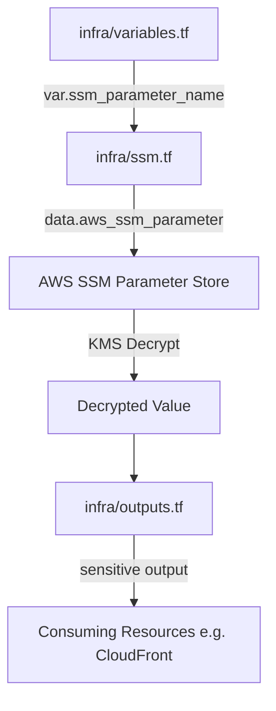

# Design Document: SSM Parameter Store Retrieval

## Overview

This design describes a self-contained Terraform module in the `infra` directory at the project root. The module retrieves an encrypted SSM Parameter Store value using KMS decryption and exposes it as a sensitive Terraform output. The design follows the existing project conventions (resource naming, tagging, provider region) while isolating the SSM retrieval concern from the broader infrastructure in `tf/`.

The module is intentionally minimal — four files, one data source, one variable, one output — so that it can be composed into other configurations via `terraform_remote_state` or module references.

## Architecture



### Directory Layout

```
geofoodtruck/
├── infra/
│   ├── main.tf          # (existing) terraform block, provider, aws_caller_identity, aws_region
│   ├── ssm.tf           # (NEW) SSM parameter data source only
│   ├── variables.tf     # (existing, APPEND) ssm_parameter_name variable with validation
│   └── outputs.tf       # (existing, APPEND) sensitive output exposing decrypted value
```

### Separation of Concerns

This feature adds to the existing `infra/` module — it does not create its own provider or shared data sources. The `infra/` module is independent of the `tf/` directory. Other modules or configurations consume the output via `terraform_remote_state` data sources or direct module calls.

## Components and Interfaces

### 1. Provider Configuration (`infra/main.tf` — already exists, not created by this feature)

The following resources are already declared in `infra/main.tf` and are NOT part of this feature's implementation:

- `terraform` block with `required_providers` (`hashicorp/aws`, `~> 5.0`)
- `provider "aws"` with `region = "us-east-1"`
- `data "aws_caller_identity" "current" {}`
- `data "aws_region" "current" {}`

This feature relies on these existing declarations.

### 2. SSM Parameter Data Source (`infra/ssm.tf`)

```hcl
data "aws_ssm_parameter" "sfgov_geofoodtruck_aws_ssm_parameter" {
  name            = var.ssm_parameter_name
  with_decryption = true
}
```

**Rationale:** The SSM parameter data source retrieves the encrypted value with KMS decryption enabled. It uses the shared AWS provider and data sources from `infra/main.tf`.

### 3. Variable Definition (`infra/variables.tf`)

```hcl
variable "ssm_parameter_name" {
  description = "SSM parameter path for the GeoFoodTruck API key"
  type        = string
  default     = "/geofoodtruck/sfgovkey"

  validation {
    condition     = can(regex("^/geofoodtruck/[a-zA-Z0-9._\\-]{1,128}$", var.ssm_parameter_name))
    error_message = "Parameter name must follow /geofoodtruck/<parameter_name> format where parameter_name contains alphanumeric characters, hyphens, underscores, or periods (max 128 chars)."
  }
}
```

**Rationale:**
- The regex enforces the `/geofoodtruck/` prefix followed by 1–128 characters from the allowed set (alphanumeric, hyphens, underscores, periods).
- This validates that the path starts with `/` (required by the acceptance criteria) and conforms to the project's naming hierarchy.
- The `default` value points to the known production parameter (`/geofoodtruck/sfgovkey`), enabling zero-config deployment for the primary use case.

### 4. Output Definition (`infra/outputs.tf`)

```hcl
output "geofoodtruck_ssm_parameter_value" {
  description = "Decrypted SSM parameter value for GeoFoodTruck API authentication"
  value       = data.aws_ssm_parameter.sfgov_geofoodtruck_aws_ssm_parameter.value
  sensitive   = true
}
```

**Rationale:**
- `sensitive = true` prevents the decrypted value from appearing in CLI output, plan diffs, or logs.
- The identifier uses the `geofoodtruck_` prefix per the project naming convention.
- The `description` explains purpose for discoverability in `terraform output` listings.

## Data Models

### Terraform State Representation

| Attribute | Type | Source | Sensitive |
|-----------|------|--------|-----------|
| `data.aws_ssm_parameter.sfgov_geofoodtruck_aws_ssm_parameter.value` | string | AWS SSM API | Yes (marked by provider) |
| `data.aws_ssm_parameter.sfgov_geofoodtruck_aws_ssm_parameter.name` | string | Variable input | No |
| `data.aws_ssm_parameter.sfgov_geofoodtruck_aws_ssm_parameter.type` | string | AWS SSM API | No |
| `data.aws_ssm_parameter.sfgov_geofoodtruck_aws_ssm_parameter.arn` | string | AWS SSM API | No |

### Variable Validation Domain

| Constraint | Rule |
|-----------|------|
| Prefix | Must start with `/geofoodtruck/` |
| Name segment charset | `[a-zA-Z0-9._-]` |
| Name segment length | 1–128 characters |
| Total path length | 14–142 characters (prefix + name) |

## Correctness Properties

Since this is Infrastructure as Code, traditional property-based testing does not apply. Instead, correctness is expressed as **structural invariants** verifiable through `terraform plan -out=plan.bin && terraform show -json plan.bin` output or static analysis tools (e.g., `tflint`, `checkov`, OPA/Conftest policies).

### Property 1: Exactly Four Files in infra/

The `infra/` directory SHALL contain exactly four `.tf` files: `main.tf`, `ssm.tf`, `variables.tf`, `outputs.tf`. No other `.tf` files, state files, or `.terraform` directories shall be present under version control.

**Validates: Requirements 8.1, 8.6**

### Property 2: SSM Data Source Decryption Enabled

In the plan JSON, every resource of type `aws_ssm_parameter` (mode `data`) SHALL have `with_decryption` set to `true`.

**Validates: Requirements 1.2, 3.1**

### Property 3: Output Sensitivity

Every `output` block whose `value` expression references a `data.aws_ssm_parameter` resource (where `with_decryption = true`) SHALL have `sensitive = true`.

**Validates: Requirements 4.2, 6.1, 6.3**

### Property 4: Variable Validation Presence

The `ssm_parameter_name` variable SHALL contain at least one `validation` block whose `condition` rejects paths not matching the `/geofoodtruck/` prefix pattern.

**Validates: Requirements 2.3, 2.4, 5.5**

### Property 5: No Hardcoded Parameter Name in Data Source

The `name` argument of the `aws_ssm_parameter` data source SHALL reference a variable (`var.*`) — not a string literal.

**Validates: Requirements 1.3, 5.4**

### Property 6: Provider Region Fixed to us-east-1

The AWS provider block SHALL specify `region = "us-east-1"`.

**Validates: Requirements 7.2**

### Property 7: Required Providers Source

The `required_providers` block SHALL include an `aws` entry with `source = "hashicorp/aws"`.

**Validates: Requirements 7.1**

### Property 8: No Provisioner or Null Resource Blocks

The `infra/` module SHALL NOT contain any `provisioner`, `null_resource`, or `terraform_data` resource blocks that could log sensitive values.

**Validates: Requirements 6.2**

### Property 9: No Duplicate Provider or Data Source Declarations

The `infra/ssm.tf` file SHALL NOT declare `terraform` blocks, `provider` blocks, `data "aws_caller_identity"`, or `data "aws_region"` — these are managed in `infra/main.tf`.

**Validates: Requirements 7.1, 7.2, 7.3, 7.4**

## Error Handling

| Failure Scenario | Behavior | User Action |
|-----------------|----------|-------------|
| SSM parameter does not exist | Terraform surfaces `ParameterNotFound` AWS API error during plan/apply | Verify parameter path exists in target account/region |
| KMS key disabled or deleted | Terraform surfaces `DisabledException` or `NotFoundException` | Re-enable or recreate KMS key, verify key policy |
| Insufficient IAM permissions (kms:Decrypt) | Terraform surfaces `AccessDeniedException` | Attach `kms:Decrypt` permission for the GeoFoodTruck KMS key to the execution role |
| Insufficient IAM permissions (ssm:GetParameter) | Terraform surfaces `AccessDeniedException` | Attach `ssm:GetParameter` permission for the parameter ARN to the execution role |
| Variable validation failure | Terraform rejects input before plan with custom error message | Correct parameter name to match `/geofoodtruck/<name>` pattern |

The module intentionally does NOT wrap or suppress AWS API errors. Terraform's native data source failure behavior provides clear, actionable error messages to the operator.

## Testing Strategy

### Approach

Since this is IaC (Terraform HCL), property-based testing does not apply. The testing strategy uses:

1. **Static analysis** — Validate structure and security compliance without deploying
2. **Plan-based validation** — Assert invariants against `terraform plan` JSON output
3. **Integration smoke tests** — Verify actual retrieval in a sandbox account

### Static Analysis (Pre-commit / CI)

| Tool | Purpose |
|------|---------|
| `terraform validate` | Syntax and internal consistency |
| `terraform fmt -check` | Formatting compliance |
| `tflint` | Lint rules and best practices |
| `checkov` | Security policy compliance (sensitive outputs, no provisioners) |

### Plan JSON Validation (CI)

Run `terraform plan -out=plan.bin && terraform show -json plan.bin` and assert:

- **Property 2**: Parse `planned_values.root_module.resources[]` — confirm `aws_ssm_parameter` data source has `with_decryption = true`
- **Property 3**: Parse `configuration.root_module.outputs[]` — confirm the SSM output has `sensitive = true`
- **Property 5**: Parse `configuration.root_module.resources[]` — confirm the `name` expression references a variable
- **Property 6**: Parse provider config — confirm region equals `us-east-1`
- **Property 7**: Parse `configuration.provider_config` — confirm `hashicorp/aws` source

### File Structure Validation (CI)

A simple shell or script check:

```bash
# Property 8: No provisioner blocks
! grep -r "provisioner\|null_resource\|terraform_data" infra/ssm.tf

# Property 9: No duplicate provider or data source declarations in ssm.tf
! grep -q 'required_providers' infra/ssm.tf
! grep -q 'provider "aws"' infra/ssm.tf
! grep -q 'data "aws_caller_identity"' infra/ssm.tf
! grep -q 'data "aws_region"' infra/ssm.tf
```

### Integration Smoke Test (Sandbox Account)

1. Initialize with `terraform init` in `infra/`
2. Run `terraform plan` — confirm no errors (parameter exists, KMS key accessible)
3. Run `terraform apply` — confirm output is marked `(sensitive value)`
4. Run `terraform output -json` — confirm the output key exists (value redacted unless `-raw`)

### Variable Validation Tests

Use `terraform plan` with invalid inputs to confirm rejection:

| Input | Expected |
|-------|----------|
| `"/other/path"` | Validation error: must start with `/geofoodtruck/` |
| `"geofoodtruck/noprefix"` | Validation error: must start with `/` |
| `"/geofoodtruck/"` | Validation error: name segment required |
| `"/geofoodtruck/valid-key_name.v2"` | Passes validation |
| `"/geofoodtruck/sfgovkey"` (default) | Passes validation |
