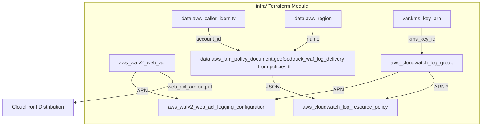

# Design Document: WAFv2 Web ACL Terraform Module

## Overview

This design describes a self-contained Terraform module in the `infra` directory that provisions an AWS WAFv2 Web ACL with four managed rule groups, CloudWatch logging with KMS encryption, and a log resource policy. The module is scoped for CLOUDFRONT and outputs the Web ACL ARN for association with the GeoFoodTruck CloudFront distribution.

The module is intentionally isolated from the existing `tf/` directory so it can be applied independently or consumed as a child module.

## Architecture



**Design Decisions:**

1. **Shared `infra` directory** — WAF resources are added to the existing `infra` directory alongside other infrastructure modules. This feature relies on the shared provider and data sources in `infra/main.tf` rather than declaring its own.
2. **KMS key supplied externally** — The module accepts a `kms_key_arn` variable rather than creating a key, allowing reuse of an existing KMS key provisioned elsewhere.
3. **No retention limit** — The CloudWatch Log Group omits `retention_in_days` (defaults to indefinite retention) to meet compliance requirements.
4. **Override action `none`** — All four managed rule groups use `override_action { none {} }` so that the individual rule actions within each group take effect as-is.
5. **Bot Control count overrides** — 17 bot categories are set to `count` to monitor without blocking, while unlisted bot rules retain the default block action.

## Components and Interfaces

### File Structure

```
infra/
├── main.tf          # (existing) terraform block, provider, aws_caller_identity, aws_region
├── waf.tf           # (NEW) All WAF resources (no data sources for identity/region)
├── variables.tf     # (existing, APPEND) Input variable: kms_key_arn
└── outputs.tf       # (existing, APPEND) Output: web_acl_arn
```

### Resource Inventory

| Resource Type | Identifier | Purpose |
|---|---|---|
| `aws_wafv2_web_acl` | `geofoodtruck_waf_web_acl` | Web ACL with 4 managed rule groups |
| `aws_cloudwatch_log_group` | `geofoodtruck_waf_log_group` | Encrypted WAF log storage |
| `aws_wafv2_web_acl_logging_configuration` | `geofoodtruck_waf_logging_configuration` | Connects Web ACL to log group |
| `aws_cloudwatch_log_resource_policy` | `geofoodtruck_waf_log_resource_policy` | Grants log delivery permissions |
| `data.aws_iam_policy_document` | `geofoodtruck_waf_log_delivery` | WAF log delivery policy JSON (defined in policies.tf by iam-roles-and-policy-documents feature, not this feature) |
| `data.aws_caller_identity` | `current` | Dynamic account ID (in main.tf, not this feature) |
| `data.aws_region` | `current` | Dynamic region name (in main.tf, not this feature) |

### Interfaces

- **Input:** `var.kms_key_arn` (string) — ARN of the KMS key for log encryption
- **Output:** `web_acl_arn` — ARN of the Web ACL for CloudFront association

## Data Models

### Provider Configuration (`infra/main.tf` — already exists, not created by this feature)

The following are already declared in `infra/main.tf` and are NOT part of this feature's implementation:

- `terraform` block with `required_providers` (`hashicorp/aws`, `~> 5.0`)
- `provider "aws"` with `region = "us-east-1"`
- `data "aws_caller_identity" "current" {}`
- `data "aws_region" "current" {}`

This feature relies on these existing declarations.

### HCL: `infra/waf.tf`

```hcl
# Data sources aws_caller_identity and aws_region are in main.tf (not redeclared here)

# -----------------------------------------------------------------------------
# WAFv2 Web ACL
# -----------------------------------------------------------------------------
resource "aws_wafv2_web_acl" "geofoodtruck_waf_web_acl" {
  name        = "GeoFoodTruckWebACL"
  scope       = "CLOUDFRONT"
  description = "Web ACL for GeoFoodTruck app"

  default_action {
    allow {}
  }

  # Rule 1: IP Reputation (priority 0)
  rule {
    name     = "GeoFoodTruck-AWSManagedRulesAmazonIpReputationList"
    priority = 0

    statement {
      managed_rule_group_statement {
        name        = "AWSManagedRulesAmazonIpReputationList"
        vendor_name = "AWS"
      }
    }

    override_action {
      none {}
    }

    visibility_config {
      cloudwatch_metrics_enabled = true
      metric_name                = "GeoFoodTruck-AWSManagedRulesAmazonIpReputationList"
      sampled_requests_enabled   = true
    }
  }

  # Rule 2: Common Rule Set (priority 1)
  rule {
    name     = "GeoFoodTruck-AWSManagedRulesCommonRuleSet"
    priority = 1

    statement {
      managed_rule_group_statement {
        name        = "AWSManagedRulesCommonRuleSet"
        vendor_name = "AWS"
      }
    }

    override_action {
      none {}
    }

    visibility_config {
      cloudwatch_metrics_enabled = true
      metric_name                = "GeoFoodTruck-AWSManagedRulesCommonRuleSet"
      sampled_requests_enabled   = true
    }
  }

  # Rule 3: Known Bad Inputs (priority 2)
  rule {
    name     = "GeoFoodTruck-AWSManagedRulesKnownBadInputsRuleSet"
    priority = 2

    statement {
      managed_rule_group_statement {
        name        = "AWSManagedRulesKnownBadInputsRuleSet"
        vendor_name = "AWS"
      }
    }

    override_action {
      none {}
    }

    visibility_config {
      cloudwatch_metrics_enabled = true
      metric_name                = "GeoFoodTruck-AWSManagedRulesKnownBadInputsRuleSet"
      sampled_requests_enabled   = true
    }
  }

  # Rule 4: Bot Control (priority 3)
  rule {
    name     = "GeoFoodTruck-AWSManagedRulesBotControlRuleSet"
    priority = 3

    statement {
      managed_rule_group_statement {
        name        = "AWSManagedRulesBotControlRuleSet"
        vendor_name = "AWS"

        managed_rule_group_configs {
          aws_managed_rules_bot_control_rule_set {
            inspection_level = "COMMON"
          }
        }

        rule_action_override {
          name = "CategoryAdvertising"
          action_to_use { 
            count {} 
          }
        }
        rule_action_override {
          name = "CategoryArchiver"
          action_to_use { 
            count {} 
          }
        }
        rule_action_override {
          name = "CategoryContentFetcher"
          action_to_use { 
            count {} 
          }
        }
        rule_action_override {
          name = "CategoryEmailClient"
          action_to_use { 
            count {} 
          }
        }
        rule_action_override {
          name = "CategoryHttpLibrary"
          action_to_use { 
            count {} 
          }
        }
        rule_action_override {
          name = "CategoryLinkChecker"
          action_to_use { 
            count {} 
          }
        }
        rule_action_override {
          name = "CategoryMiscellaneous"
          action_to_use { 
            count {} 
          }
        }
        rule_action_override {
          name = "CategoryMonitoring"
          action_to_use { 
            count {} 
          }
        }
        rule_action_override {
          name = "CategoryScrapingFramework"
          action_to_use { 
            count {} 
          }
        }
        rule_action_override {
          name = "CategorySearchEngine"
          action_to_use { 
            count {} 
          }
        }
        rule_action_override {
          name = "CategorySecurity"
          action_to_use { 
            count {} 
          }
        }
        rule_action_override {
          name = "CategorySeo"
          action_to_use { 
            count {} 
          }
        }
        rule_action_override {
          name = "CategorySocialMedia"
          action_to_use { 
            count {} 
          }
        }
        rule_action_override {
          name = "CategoryAI"
          action_to_use { 
            count {} 
          }
        }
        rule_action_override {
          name = "SignalAutomatedBrowser"
          action_to_use { 
            count {} 
          }
        }
        rule_action_override {
          name = "SignalKnownBotDataCenter"
          action_to_use { 
            count {} 
          }
        }
        rule_action_override {
          name = "SignalNonBrowserUserAgent"
          action_to_use { 
            count {} 
          }
        }
      }
    }

    override_action {
      none {}
    }

    visibility_config {
      cloudwatch_metrics_enabled = true
      metric_name                = "GeoFoodTruck-AWSManagedRulesBotControlRuleSet"
      sampled_requests_enabled   = true
    }
  }

  visibility_config {
    cloudwatch_metrics_enabled = true
    metric_name                = "GeoFoodTruckWebACL"
    sampled_requests_enabled   = true
  }
}

# -----------------------------------------------------------------------------
# CloudWatch Log Group
# -----------------------------------------------------------------------------
resource "aws_cloudwatch_log_group" "geofoodtruck_waf_log_group" {
  name       = "aws-waf-logs-geofoodtruck-log-group"
  kms_key_id = var.kms_key_arn
}

# -----------------------------------------------------------------------------
# WAFv2 Logging Configuration
# -----------------------------------------------------------------------------
resource "aws_wafv2_web_acl_logging_configuration" "geofoodtruck_waf_logging_configuration" {
  log_destination_configs = [aws_cloudwatch_log_group.geofoodtruck_waf_log_group.arn]
  resource_arn            = aws_wafv2_web_acl.geofoodtruck_waf_web_acl.arn
}

# -----------------------------------------------------------------------------
# Log Resource Policy (uses policy document from infra/policies.tf)
# -----------------------------------------------------------------------------
resource "aws_cloudwatch_log_resource_policy" "geofoodtruck_waf_log_resource_policy" {
  policy_document = data.aws_iam_policy_document.geofoodtruck_waf_log_delivery.json
  policy_name     = "geofoodtruck-webacl-log-resource-policy"
}

# NOTE: The data "aws_iam_policy_document" "geofoodtruck_waf_log_delivery" is
# defined in infra/policies.tf by the iam-roles-and-policy-documents feature.
# It grants logs:CreateLogStream and logs:PutLogEvents to delivery.logs.amazonaws.com
# scoped to the WAF log group ARN with ArnLike and StringEquals conditions.
```

### HCL: `infra/variables.tf`

```hcl
variable "kms_key_arn" {
  description = "ARN of the KMS key used to encrypt the WAF CloudWatch Log Group"
  type        = string
}
```

### HCL: `infra/outputs.tf`

```hcl
output "web_acl_arn" {
  description = "ARN of the WAFv2 Web ACL for CloudFront association"
  value       = aws_wafv2_web_acl.geofoodtruck_waf_web_acl.arn
}
```

## Correctness Properties

Since this is an Infrastructure as Code module, property-based testing (PBT) does not apply. Instead, correctness is expressed as **structural invariants** that can be verified against `terraform plan -out=plan.bin && terraform show -json plan.bin` output or static HCL analysis (e.g., using `jq`, OPA/Conftest, or Checkov custom policies).

### Property 1: Web ACL contains exactly 4 rules

The planned `aws_wafv2_web_acl` resource SHALL contain exactly 4 entries in its `rule` array. This guarantees no rule was accidentally added or removed.

**Validates: Requirements 1.6**

### Property 2: Rule priorities are unique and sequential starting at 0

The 4 rules SHALL have priorities `[0, 1, 2, 3]` with no duplicates and no gaps.

**Validates: Requirements 2.2, 3.2, 4.2, 5.2**

### Property 3: All managed rule groups use override_action none

For each of the 4 rules, the `override_action` SHALL be `{ none {} }` (not `count` or `block`), ensuring individual rule actions take effect.

**Validates: Requirements 2.3, 3.3, 4.3, 5.3**

### Property 4: Bot Control contains exactly 17 rule_action_override entries

The Bot Control rule's `managed_rule_group_statement` SHALL contain exactly 17 `rule_action_override` blocks, each with action `count {}`.

**Validates: Requirements 5.5**

### Property 5: Bot Control inspection level is COMMON

The Bot Control rule's `managed_rule_group_configs.aws_managed_rules_bot_control_rule_set.inspection_level` SHALL equal `"COMMON"`.

**Validates: Requirements 5.4**

### Property 6: CloudWatch Log Group is KMS-encrypted

The planned `aws_cloudwatch_log_group` resource SHALL have a non-empty `kms_key_id` attribute.

**Validates: Requirements 6.2**

### Property 7: Logging configuration references correct resources

The `aws_wafv2_web_acl_logging_configuration` SHALL reference the Web ACL ARN in `resource_arn` and the Log Group ARN in `log_destination_configs[0]`.

**Validates: Requirements 7.2, 7.3**

### Property 8: Log resource policy grants only required actions

The IAM policy document SHALL grant exactly `["logs:CreateLogStream", "logs:PutLogEvents"]` to `delivery.logs.amazonaws.com` — no additional actions.

**Validates: Requirements 8.3**

### Property 9: Log resource policy includes both conditions

The IAM policy statement SHALL include an `ArnLike` condition on `aws:SourceArn` AND a `StringEquals` condition on `aws:SourceAccount`.

**Validates: Requirements 8.5, 8.6**

### Property 10: Web ACL scope is CLOUDFRONT

The `aws_wafv2_web_acl` resource SHALL have `scope = "CLOUDFRONT"`.

**Validates: Requirements 1.1**

### Property 11: All visibility_config blocks enable CloudWatch metrics

Every `visibility_config` block (top-level and per-rule, 5 total) SHALL have `cloudwatch_metrics_enabled = true` and `sampled_requests_enabled = true`.

**Validates: Requirements 1.5, 2.4, 3.4, 4.4, 5.7**

## Error Handling

| Scenario | Behavior |
|---|---|
| Invalid `kms_key_arn` value | Terraform plan fails with AWS API error indicating the key ARN is not valid or not accessible |
| Missing KMS key permissions for CloudWatch Logs | `apply` fails with AccessDeniedException; resolved by ensuring the KMS key policy grants `logs.<region>.amazonaws.com` encrypt/decrypt |
| Log Group name does not start with `aws-waf-logs-` | AWS WAFv2 rejects the logging configuration at apply time — the design hardcodes the correct prefix |
| Web ACL scope mismatch with CloudFront | CloudFront rejects a REGIONAL-scoped Web ACL — the design hardcodes `CLOUDFRONT` scope |
| Duplicate rule priority | Terraform plan succeeds but AWS API rejects at apply time — the design assigns unique sequential priorities |

## Testing Strategy

Since this is an IaC module, property-based testing is not applicable. The testing strategy uses:

### Static Analysis (Pre-Plan)

- **`terraform validate`** — Confirms HCL syntax and internal reference integrity
- **`terraform fmt -check`** — Enforces canonical formatting
- **Checkov / tfsec** — Scans for security misconfigurations (e.g., unencrypted log groups, overly permissive IAM)

### Plan-Based Assertions (Post-Plan, Pre-Apply)

Run `terraform plan -out=plan.bin && terraform show -json plan.bin` and assert structural properties against the JSON output using a test harness (e.g., a script with `jq`, OPA/Conftest policies, or a Jest/pytest test that parses the JSON):

1. Assert resource count: exactly 4 resources + 2 data sources + 1 log resource policy
2. Assert the 11 correctness properties defined above against the planned resource values
3. Assert no `destroy` or `update` actions on resources that should be create-only in a fresh apply

### Integration Smoke Test (Post-Apply)

After a successful `terraform apply` to a test environment:

1. Verify the Web ACL is visible via `aws wafv2 get-web-acl`
2. Verify the log group exists via `aws logs describe-log-groups`
3. Verify the logging configuration is active via `aws wafv2 get-logging-configuration`
4. Verify the log resource policy via `aws logs describe-resource-policies`

### CI Pipeline Integration

- GitHub Actions workflow runs `terraform validate`, `terraform plan`, and the plan-based assertions on every PR touching `infra/`
- Checkov scan runs as a separate job using the existing `.github/checkov.yaml` configuration
